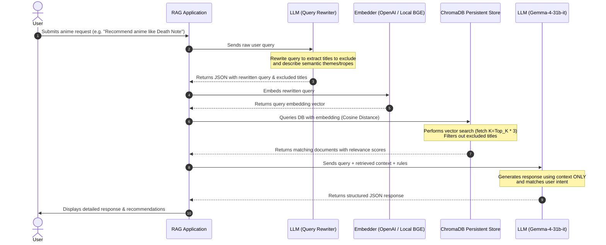

# 🎌 Anime RAG (Retrieval-Augmented Generation) System

An end-to-end pipeline that embeds structured anime documents into a ChromaDB vector store, and runs a conversational RAG recommendation system using query rewriting (Gemma 4 / Gemini) and semantic vector search (OpenAI / local BGE).

---

## 🛠️ System Architecture & Workflow

The system is focused on two main processes: **Data Embedding** (populating the vector database) and **Conversational RAG Search** (retrieval, rewriting, and synthesis).

### Conversational RAG Search Workflow

When a user asks a question, the application executes the following pipeline to retrieve and synthesize answers:



---

## 📁 Project Directory Structure

| Path | Type | Description |
| :--- | :--- | :--- |
| [core_rag/](core_rag/) | Directory | **Cloud-Based RAG Implementation** (using OpenAI embeddings and Gemini API). |
| ├─ [embed_data.py](core_rag/embed_data.py) | File | Reads clean docs, batches inputs, computes token limits, embeds using OpenAI API, saves to ChromaDB. |
| └─ [rag_search.py](core_rag/rag_search.py) | File | Complete RAG search CLI with query rewriting, vector search, and Gemini reasoning. |
| [core_rag_local/](core_rag_local/) | Directory | **Local-Based RAG Implementation** (running sentence-transformers and local DB). |
| ├─ [embed_data_local.py](core_rag_local/embed_data_local.py) | File | Locally embeds documents via `BAAI/bge-large-en-v1.5` Hugging Face model. |
| └─ [rag_search_local.py](core_rag_local/rag_search_local.py) | File | Search pipeline using local BGE model embeddings and Gemini Gemma-4 synthesis. |
| [.env](.env) | File | Environment configuration file storing API credentials. |
| [requirements.txt](requirements.txt) | File | Python libraries and dependencies list. |

---

## 🔍 Core Code Explanation

### 1. Cloud-Based Pipeline (`core_rag/`)

#### A. Embedding Document Data ([core_rag/embed_data.py](core_rag/embed_data.py))
- **Embedder Model**: `text-embedding-3-small` (1536-dimensions).
- **Token-Aware Batching**: Utilizes `tiktoken` to count tokens of documents in advance. Batches are strictly limited to `MAX_TOKENS_REQ = 250,000` tokens and `MAX_INPUTS_REQ = 2048` documents to prevent OpenAI API limits from being breached.
- **Smart Retrying**: Built-in exponential backoff with random jitter to gracefully handle Rate Limits (429) and Server Errors (50x).
- **Clean Inserts**: Checks existing vectors in ChromaDB prior to execution to support incremental resumes. Converts nested lists in metadata into formatted strings to prevent database validation exceptions.

#### B. Executing Searches ([core_rag/rag_search.py](core_rag/rag_search.py))
- **Query Rewriting (`rewrite_query`)**:
  Using `gemma-4-31b-it`, the user's raw query is rewritten to focus on core semantic themes (genres, plot devices, tropes). At the same time, it extracts anime names that the user mentions (e.g., in "anime similar to Narutos", "Narutos" will be isolated) so they can be explicitly filtered out of vector results.
- **Metadata-Enriched Search (`search`)**:
  Queries the database with the generated embedding. The search requests an expanded result count `n_results = top_k * 3` if exclusion titles exist. Results are filtered on client side to remove titles matching `excluded_titles` (e.g. self-recommendations) and re-sorted using a customized weight: `(relevance_score, mal_score)`.
- **Reasoning with Context (`ask_llm`)**:
  Feeds the final structured context (complete with relevance metrics and MAL score indicators) to `gemma-4-31b-it` alongside strict system rules:
  - Base answers **only** on provided context.
  - Rank recommendations by fit.
  - Structure output into strict JSON schema containing a conversational message, top recommendations with explicit reasoning, and lists of all retrieved sources.

---

### 2. Local-Based Pipeline (`core_rag_local/`)

#### A. Embedding Locally ([core_rag_local/embed_data_local.py](core_rag_local/embed_data_local.py))
- **Model**: `BAAI/bge-large-en-v1.5` using the `sentence-transformers` library.
- **Similarity Measure**: Uses **Cosine Similarity** (`hnsw:space = cosine`) which provides optimal mapping for BGE embeddings.
- **Local Generation**: Runs offline without API keys, computing normalized embeddings in standard batches of 128 documents before loading them directly into the local Chroma store.

#### B. Local Retrieval CLI ([core_rag_local/rag_search_local.py](core_rag_local/rag_search_local.py))
- **Query Encoding**: Appends the mandatory BGE search prompt prefix: `"Represent this sentence for searching relevant passages: "` before encoding the query.
- **Chroma Query**: Pulls matching documents from the local database.
- **Gemini Synthesis**: Feeds the context sorted by MAL Score to `gemma-4-31b-it` to obtain structured response JSONs.

---

## 🚀 Setup & Execution

### 1. Environment Configuration
Ensure your API keys are configured in your `.env` file inside the root directory:
```env
GEMINI_API_KEY="your-gemini-api-key"
OPENAI_API_KEY="your-openai-api-key"
```

### 2. Install Dependencies
Activate your virtual environment and install the required dependencies:
```powershell
# Activate venv
.venv\Scripts\Activate.ps1

# Install requirements
pip install -r requirements.txt
```

### 3. Running the Embeddings
To embed the documents and populate your vector store:

**Cloud Setup:**
```powershell
python core_rag/embed_data.py
```

**Local Setup:**
```powershell
python core_rag_local/embed_data_local.py
```

### 4. Querying the System
Launch the interactive CLI to query the system:

**Cloud Setup:**
```powershell
python core_rag/rag_search.py
```

**Local Setup:**
```powershell
python core_rag_local/rag_search_local.py
```
